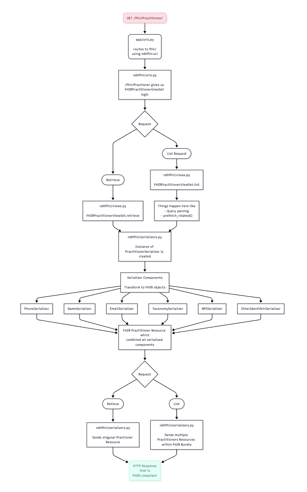

# npdfhir
Django backend that provides a FHIR API for accessing data from the npd database.

## Project structure
* The npdfhir directory contains code that drives the api
* The app directory contains code that controls the overall application
* The root directory contains code for deploying the application within a docker container

## Contributing to the API
### Prerequesites
- [docker](https://www.docker.com/)
- [colima](https://github.com/abiosoft/colima) (if using macOS)
- a postgres database with the npd schema

### Local dev
1. Ensure that either colima (if using macOS) or the docker service is running
2. Create a `.env` file in this directory, following the template of the `.env_template` file
    * n.b. ensure that NPD_DB_HOST is set to `db` if using a local postgres instance.
3. Run `docker-compose up --build` initially and following any changes
4. Happy coding!

### Running Tests

Without docker:

1. Ensure that you have a running local postgres instance
2. Make sure that you have a working `.env` file as described above
3. Make sure all python dependencies are installed in a venv or otherwise
4. Navigate to the `backend/` directory and run `./manage.py test`

With docker:

1. Run `make test`

### Automated Testing

Automated tests run in a GitHub workflow whenever a PR is created or a push is made to the main branch. These tests run in docker and build the backend image each time before running the tests. The tests generate JUnit XML files that are used as artifacts. The artifacts are then uploaded in the same GitHub workflow. 

Additionally, the artifacts are taken and used to populate an automated comment and check summary. The check summary can be viewed by navigating to the "checks" section of the PR. The automated comment is made first initially when the PR is created and subsequent comments are only made if the status of the tests change as new commits are added to the PR branch. 

The test checks are supported by an upstream GitHub action: [EnricoMi/publish-unit-test-result-action](github.com/EnricoMi/publish-unit-test-result-action). Further options for the action can be found on the README.md for that project. 

## Documentation
API documentation can be viewed at `/fhir/docs`. If you make any changes to the Views, please update the swagger schema accordingly.

## Understanding the Flow of Data through the FHIR API
