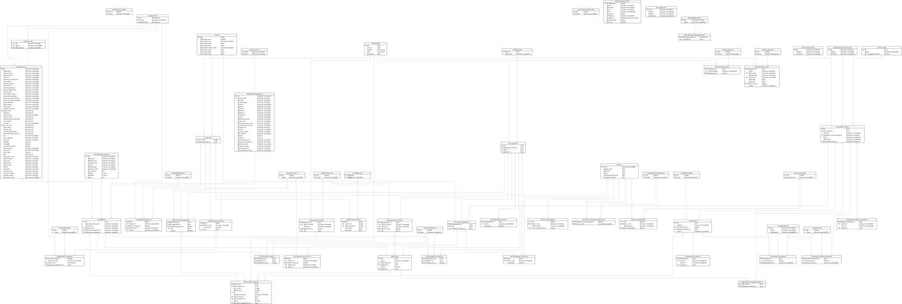

# Flyway

## Migrations

This directory contains migrations for the National Provider Directory FHIR API to be managed by Flyway. An ERD of the current state of the database can be found [here](https://lucid.app/lucidchart/5dee1836-3504-4a2a-b451-a5a70a124ef0/edit?beaconFlowId=F150B15AB3ECFD81&invitationId=inv_f541bf50-8a81-4c11-8532-39bd634fd2bb&page=0_0#).
When schema changes are needed, they are to be defined using SQL scripts and placed here following this naming scheme:

```bash
V<VERSION_NO>__<describe_the_change>.sql
```

Where `VERSION_NO` is an ascending value describing the order in which to apply the migration scripts. The version number
is followed by two underscore characters. Some examples:

```bash
V1__initial_schema.sql
V2__add_new_address_type.sql
V2_1__correct_new_address_type.sql # note that version number `2_1` is OK!
V3__add_new_provider.sql
```

The contents of each script are a valid SQL statement e.g.

```sql
---
Adds a address table to the npd schema
---
CREATE TABLE npd.address (
    id uuid NOT NULL,
    barcode_delivery_code character varying(12),
    smarty_key character varying(10),
    address_us_id uuid,
    address_international_id uuid,
    address_nonsta,ndard_id uuid
);
```

Flyway keeps track of what migrations have been performed by updating a migration metadata table in the database. 
For local development, Flyway will check to see if any migrations need to be performed (updating the database accordingly) 
on `docker compose up`.

## Inserts

This directory contains repeatable migrations that add fixture data. These are also implemented valid SQL statements.
Repeatable migrations have a different naming scheme:

```bash
R__<describe-the-sample-data>.sql
```

## Reference

- [Migrations](https://documentation.red-gate.com/fd/migrations-271585107.html)

## Current ERD
