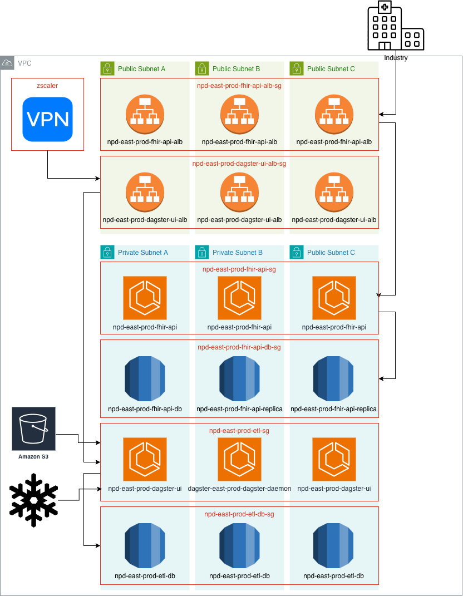

# NPD Infrastructure

## Infrastructure Diagram



## Update Cadence

- The `dev` environment is to be updated whenever updates to `main` are merged
- Releasing to `prod` is manual, requires sign-off from the PM and eng team

## Naming Conventions

The naming scheme for resources should be consistent but not too verbose.

`{project-name}-${region}-${tier}-${description}-${index?}`

Non-prod has one tier:
- `dev`

`prod-test` is in the same AWS account as prod, and is used for testing with [a copy of] production data when testing requires this.

Production is `prod`.

Some examples:

```bash
npd-east-dev-fhir-api
npd-east-prod-test-fhir-api
npd-east-dev-fhir-database
npd-east-prod-test-fhir-database-replica-1
npd-east-dev-load-fips-bronze-job
```

## Usage

### Deploy (manual)

1. Create an environment specific `.env` file, using `.env.template` as a reference
```
   (one of)
   .env.dev
   .env.prod-test
   .env.prod
```
2. Assume an AWS Role using `./ctkey.sh`
```
    (one of)
    ./ctkey.sh dev
    ./ctkey.sh prod-test
    ./ctkey.sh prod
```
3. Initialize terraform
```
    (one of)
    terraform -chdir=envs/dev init
    terraform -chdir=envs/prod-test init
    terraform -chdir=envs/prod init
```
4. Deploy resources using terraform
```
    (one of)
    terraform -chdir=envs/dev apply
    terraform -chdir=envs/prod-test apply
    terraform -chdir=envs/prod apply
```
